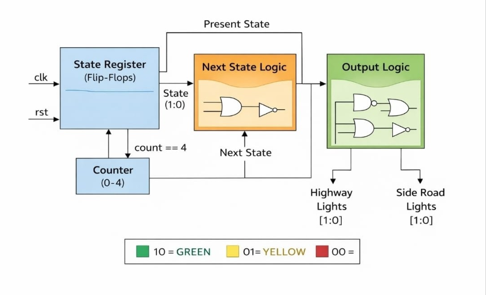
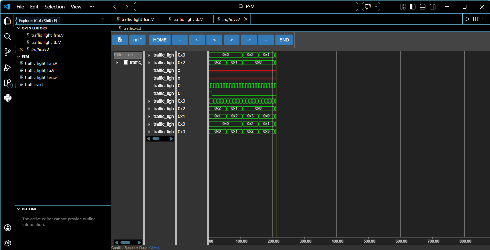
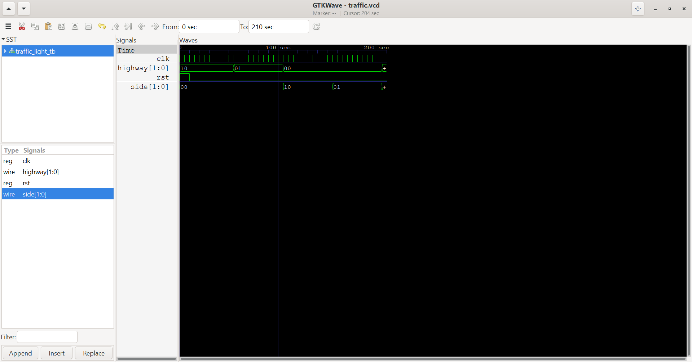

🚦 Traffic Light Controller using FSM (Verilog)

📌 Overview
This project implements a Traffic Light Controller using a Finite State Machine (FSM) in Verilog.
It controls signals for a highway and a side road using a timed sequence of states.

🧠 Concept
A Finite State Machine (FSM) is a sequential system that:
- Transitions between predefined states
- Produces outputs based on the current state
- Uses a clock for synchronization

This design is a Moore FSM, where outputs depend only on the current state.

==
🔄 State Diagram

        S0 (G,R)
          ↓
        S1 (Y,R)
          ↓
        S2 (R,G)
          ↓
        S3 (R,Y)
          ↓
         back to S0

🔹 State Description
State| Highway| Side Road
S0| GREEN| RED
S1| YELLOW| RED
S2| RED| GREEN
S3| RED| YELLOW

⚙️ Design Details
🔹 State Encoding
S0 = 00  
S1 = 01  
S2 = 10  
S3 = 11  

🔹 Output Encoding
10 = GREEN  
01 = YELLOW  
00 = RED  

## 🏗️ Architecture

### FSM Block Diagram

⏱️ Timing Mechanism
A counter is used to introduce delay:
- State changes only when "count == 4"
- Ensures stable and timed transitions

💻 Files Included
- "traffic_light_fsm.v" → FSM design
- "traffic_light_tb.v" → Testbench
- "traffic.vcd" → Waveform output
- "traffic_vs.png" → Simulation screenshot
- "traffic_gtk.png" → GTKWave screenshot
- "architecture.png" → Architecture diagram

▶️ How to Run
Using Icarus Verilog:

iverilog -o traffic traffic_light_fsm.v traffic_light_tb.v
vvp traffic
gtkwave traffic.vcd

## 📊 Waveform Results

### Simulation Output

### GTKWave Output

🔍 Waveform Explanation
- The FSM starts in S0 (Highway Green, Side Red)
- It transitions sequentially: S0 → S1 → S2 → S3
- Each transition occurs after a delay controlled by the counter
- Outputs change correctly according to each state

🎯 Key Features
- Moore FSM design
- Clean modular structure
- Counter-based timing
- Easy to understand and extend

🧪 Testbench
The testbench:
- Generates clock signal
- Applies reset
- Runs simulation
- Dumps waveform for GTKWave analysis

📚 Learning Outcomes
- FSM design and implementation
- State vs output understanding
- Hardware realization using flip-flops and logic gates
- Writing testbenches and analyzing waveforms

👨‍💻 Author

Anubhav
